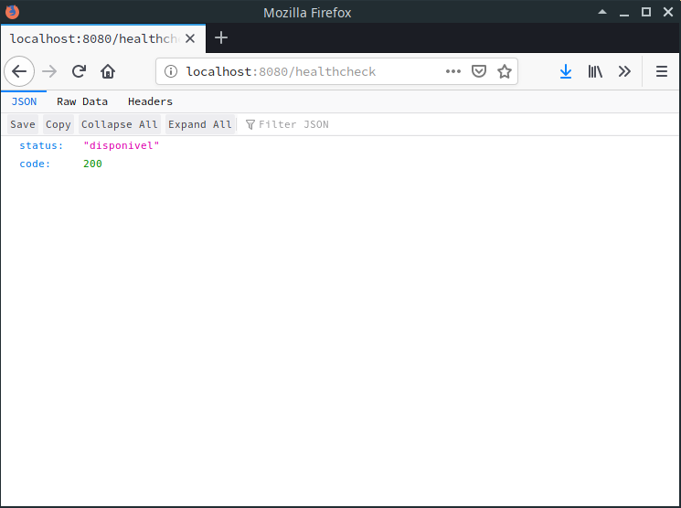

## Como eu rodo?

```
chmod +x buildae.sh
chmod +x scripts/*
./buildae.sh
```

## E como eu acesso?

`http://localhost:8080/healthcheck`



## TODO
[x] Estrutura inicial
[x] Dockenizar aplicacao
[] Implementar testcontainer 